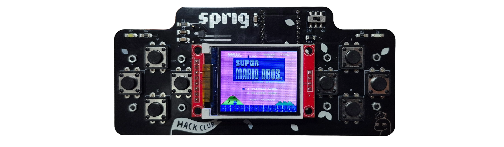
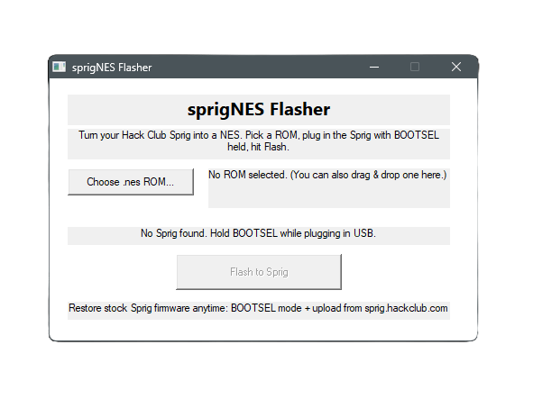

# sprigNES

**Turn a [Hack Club Sprig](https://sprig.hackclub.com/) into a pocket NES.**



> *The Super Mario Bros. cartridge shown above was dumped from an original
> copy I own. sprigNES ships with **no games** — dump cartridges you own or use
> homebrew. Please don't pirate; support the people who make games.*

sprigNES is custom firmware that runs NES games on the Sprig's exact hardware —
160×128 screen, its buttons, its speaker — with no hardware modification. A
one-click Windows flasher lets you put any `.nes` ROM on the board; no
toolchain, drivers, or command line required.

## For players — flashing a game



1. Download **`SprigNESFlasher.exe`** from the
   [latest release](../../releases/latest).
2. Run it, click **Choose .nes ROM**, and pick a game (or drag a `.nes` onto
   the window).
3. Put the Sprig into flashing mode: **hold the BOOTSEL button** (the little
   button on the Pico, reachable through the shell) while plugging in USB. The
   app will say *"Sprig detected."*
4. Click **Flash to Sprig**. The board reboots straight into the game.

**Controls:** WASD = D-pad · **L** = A · **J** = B · **I** = Start · **K** =
Select · hold **I+J+K+L** = reset.

### ROM notes

- Must be an iNES `.nes` file, **≤ 1.5 MB** (the Sprig has 2 MB of flash total).
- Mapper support comes from InfoNES: mappers 0, 1 (MMC1), 2 (UxROM), 3 (CNROM),
  4 (MMC3) and many others work. Very new homebrew mappers may not.
- Only flash ROMs you have the legal right to use. **No ROMs are included.**

## Restoring the stock Sprig

You **cannot brick** the Sprig — its bootloader is in ROM. To go back to the
normal JavaScript Sprig: enter BOOTSEL mode again and upload any game from the
[Sprig editor](https://sprig.hackclub.com/), or flash a stock firmware UF2 from
[hackclub/sprig](https://github.com/hackclub/sprig).

## For developers — building from source

Everything needed (ARM GCC, CMake, Ninja, pico-sdk, pico-extras, picotool,
Python) is vendored under `tools/` and is **not** committed — see
`scripts/fetch-tools.ps1` to populate it, or drop your own pico-sdk in. The
flasher is built with a system MinGW-w64 GCC.

```powershell
.\build.ps1          # builds build\sprignes.uf2 and build\SprigNESFlasher.exe
```

To make a UF2 for one specific game without the GUI:

```powershell
.\build\SprigNESFlasher.exe --merge game.nes game.uf2   # firmware + ROM -> UF2
.\build\SprigNESFlasher.exe --flash game.nes            # merge and flash a connected board
```

### How it works

- **Firmware** (`src/main.cpp`) wraps the [InfoNES](https://github.com/shuichitakano/pico-infones)
  6502/PPU/APU core with a hardware shell for the Sprig:
  - **Video** — InfoNES renders NES scanlines; sprigNES crops overscan and does
    a weighted-box-filter downscale (256×224 → 160×128) in RGB565, streaming
    each line to the ST7735 over SPI DMA while the next line emulates.
  - **Audio** — the 5 APU channels are mixed to mono 22 050 Hz, DC-blocked, and
    played through the MAX98357A I2S amp via pico-extras.
  - **CPU** — RP2040 overclocked to 252 MHz; the ROM runs in place from flash.
- **ROM layout** — the firmware occupies the first 512 KB of flash and reads
  the ROM from a fixed offset (`0x10080000`). The firmware UF2 carries no ROM.
- **Flasher** (`flasher/flasher.c`) is a small Win32 app with the firmware UF2
  embedded as a resource. It validates the chosen ROM, then merges firmware +
  ROM blocks into a single UF2 and copies it to the RPI-RP2 drive.

Pin map, ST7735 init, and button order were taken from the stock
[hackclub/sprig](https://github.com/hackclub/sprig) firmware (`sprig_hal`).

## Credits & license

- **InfoNES** by Jay Kumogata and the InfoNES Project (NES core).
- **pico-infones** by [Shuichi Takano](https://github.com/shuichitakano/pico-infones)
  (the RP2040 port this core is vendored from).
- **Sprig** hardware and stock firmware by [Hack Club](https://github.com/hackclub/sprig).

sprigNES is licensed under the **GNU GPL v3** (see [LICENSE](LICENSE)), inherited
from InfoNES/pico-infones. This is a fan project and is not affiliated with or
endorsed by Hack Club or Nintendo.
